# Harshwardhan Bhaskar

<picture>
  <source media="(prefers-color-scheme: dark)" srcset="dark.svg">
  <source media="(prefers-color-scheme: light)" srcset="light.svg">
  
</picture>

  
  
  
  

---

### 🚀 About Me

I am a pre-final year **Computer Science & Engineering** student at **Birla Institute of Technology, Mesra** with a strong passion for full-stack software development, SaaS architectures, and AI-integrated computer vision systems. I specialize in building highly scalable, secure, and production-ready applications.

- 📍 **Location:** Ranchi, Jharkhand, India
- 🎓 **Education:** B.Tech in CSE @ BIT Mesra
- 🔍 **Current Focus:** Distributed microservices, AI pipelines, and real-time multiplayer synchronizations.

---

### 💼 Technical Expertise

*   **Languages:** C++, Python, SQL, Java (Basic), HTML/CSS
*   **Backend & Cloud:** FastAPI, Spring Boot, REST APIs, Microservices, Supabase Edge Functions
*   **Databases:** PostgreSQL, Supabase RLS, MySQL
*   **AI / Machine Learning:** OpenCV, DeepFace, MediaPipe, Google Gemini API, OpenAI APIs
*   **Tools & Platforms:** Git, GitHub, Docker, Linux, CI/CD pipelines, Twilio API

---

### 💻 Notable Projects

#### 1. [Cypherdon](https://github.com/HarshwardhanBhaskar) — Polyglot Microservices Platform
*   **Stack:** Python, FastAPI, Spring Boot, Java, Next.js 15, PostgreSQL, GPT-4o, Gemini.
*   Architected a polyglot microservices platform with a Python FastAPI AI engine, Spring Boot core gateway, and Next.js frontend.
*   Built an AI-powered resume ATS scorer and cold email generator using GPT-4o-mini with dynamic candidate-to-JD semantic skill matching.
*   Implemented a self-healing URL integrity engine, secured via Supabase JWT and X-Internal-Secret middleware.

#### 2. [NeuroDocs](https://github.com/HarshwardhanBhaskar) — AI Document Intelligence SaaS
*   **Stack:** Next.js, FastAPI, Python, Supabase, OpenRouter API.
*   Deployed a full-stack SaaS platform for AI-powered document classification, extraction, and summarization using OpenRouter API hybrid pipelines.
*   Designed a secure Supabase PostgreSQL schema with Row-Level Security (RLS) for strict per-user data isolation.

#### 3. [Kirmada](https://github.com/HarshwardhanBhaskar) — Real-Time Gaming Platform
*   **Stack:** React, TypeScript, Supabase, PostgreSQL, TailwindCSS, Framer Motion.
*   Developed a provably fair real-time gaming platform featuring Crash, Mines, Roulette, and Slots with live multiplayer synchronization.
*   Built a secure wallet management system with real-time balance tracking and atomic PostgreSQL transactions.

---

### 🏢 Professional Experience

**Industrial Trainee (Software & Automation)** @ *Jindal Steel and Power Limited, Patratu* *(May 2025 – June 2025)*
*   **AI Face Recognition:** Developed a real-time AI employee monitoring system processing live video at 25–30 FPS using Python, OpenCV, and DeepFace.
*   **Intruder Alerting:** Integrated a Twilio SMS alert pipeline for intruder detection triggering within 5 seconds, reducing duplicate alerts by 90% via deduplication.
*   **Automated Logging:** Built automated timestamp-based entry/exit logging, eliminating manual attendance processes.

---

### 🏆 Achievements & Leadership

*   **DSA Practice:** Solved 300+ DSA problems on LeetCode across arrays, strings, dynamic programming, and binary search.
*   **Flipkart Gridlock Hackathon 2.0:** Shortlisted for Round 2 (Prototype Round) out of 10,000+ teams, recognized for model integrity.
*   **Leadership:** DISHA Chapter Lead at Drishti NGO, managing 50–60 volunteers and coordinating 16–20 structured outreach sessions per semester.
*   **Service:** NSS Volunteer (2 years) at BIT Mesra, conducting community service drives and social awareness campaigns.

---

  

